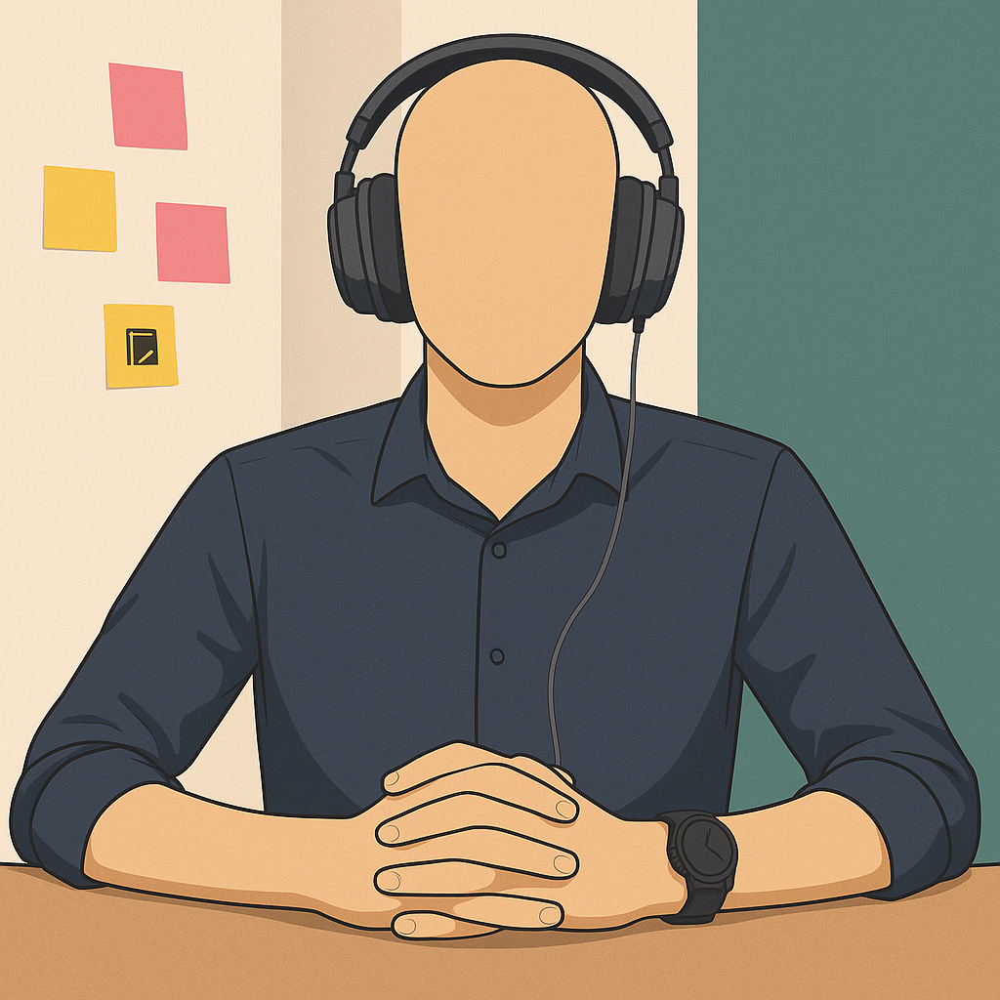
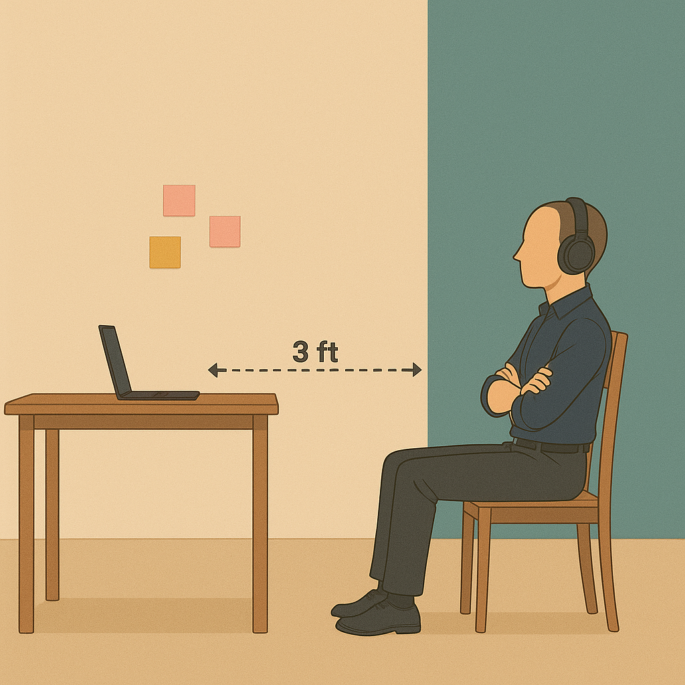

# Welcome to Your Recruit41 Interview!

We're excited to have you interview with us! To ensure a smooth and successful experience on the Recruit41 platform, please carefully review this guide.

!!! info "Quick Overview"
    This guide will help you prepare for your AI-powered interview with Kiran, our virtual interviewer. Following these guidelines will ensure a fair and effective evaluation of your skills.

## Before Your Interview

### Use Google Chrome Browser
- Our platform exclusively supports the official Google Chrome browser.

!!! warning "Unsupported Browsers"
    Please avoid using Chromium-based browsers (e.g., Brave, Arc), Safari, Microsoft Edge, or any mobile browsers.

### Check your Camera and Microphone
- **Working Equipment**: Ensure your camera and microphone are functioning correctly. Bluetooth headphones/earphones are recommended if available.

- **Bluetooth Users**: If using Bluetooth, set your devices as the default microphone and speaker in your operating system settings.

- **Test Your Setup**: Critically, test your camera and microphone at [webcammictest.com](https://webcammictest.com) well before your interview.

### Prepare for Screen Sharing
- During the interview, you might be asked to share your screen.

!!! danger "Important"
    You must share your entire screen (not just a tab or window). This is crucial for us to evaluate any code you write. Without full screen sharing, we cannot grade your code.

### Familiarize Yourself with Our Platform
- Practice with a mock interview at [https://demo.recruit41.com/](https://demo.recruit41.com/). This will help you get comfortable with audio/video controls, screen sharing, and other platform features.

### Suitable Interview Environment
- **Quiet & Distraction-Free**: Choose a location where you won't be interrupted.
- **Good Lighting**: Sit facing a light source so your face is clearly visible.
- **Minimize Background Noise**: Ensure a quiet setting for clear audio.

---

## During Your Interview

### Positioning the Camera
- **Clear View**: Your entire upper body (including face, arms, and hands) must be clearly visible to the interviewer.
- **Distance**: This typically means sitting approximately 3 feet or more away from your computer screen.
- **Pen & Paper**: You may use pen and paper, but ensure your hands, pen, and paper remain visible.
- **Exception for Coding**: When asked to write code, you may move closer to the screen.

!!! tip "Positioning Guide"

**✅ Correct Position**

{ width="45%" }
{ width="45%" }

Sitting at a proper distance, hands visible.

---

**❌ Incorrect Position**

{ width="70%" }

Sitting too close, hands not visible, using your mobile phone, looking away during the interview and not wearing headphones.

### Interacting with Kiran, your AI Interviewer
- **Thoughtful Responses**: Respond with a few complete sentences rather than 1-2 word answers. This helps Kiran (and any human reviewers) understand your thought process.
- **If Kiran seems stuck**: If Kiran appears unresponsive, prompt it by saying, "Hey Kiran, are you there?"

### Communication Etiquette
- **Listen Actively**: Allow the interviewer to finish speaking before you respond.
- **Avoid Interruptions**: Refrain from interrupting the interviewer during their question.

### Meeting Controls
- **Do Not Refresh or Close**: Avoid closing the interview tab or hitting the refresh button.
- **Pausing/Ending**: If you need to stop or pause, use the "End Meeting" button located on the bottom control panel.

### Getting Support
- **Live Chat (Recommended)**: Reach our live support team via the chat option available on the bottom control panel for the fastest response.
- **Email**: Alternatively, you can email us at [support@recruit41.com](mailto:support@recruit41.com).

---

## Frequently Asked Questions (FAQs)

??? question "The AI interviewer asks: 'Are you there?' while I am answering the question. What should I do?"
    This usually means the AI cannot hear you. Please:
  
    1. Check if your audio is muted.
    2. Ensure you've granted microphone and camera permissions to the browser.
    3. Confirm the correct microphone is selected as default in your operating system.
    4. Test your setup at [webcammictest.com](https://webcammictest.com)

??? question "What if the AI interviewer isn't responding?"
    First, try prompting it with "Hey Kiran, are you there?". If there's still no response, you can disconnect and rejoin the interview.

??? question "I faced some platform-related issues during my interview. Will it affect my application?"
    No, any platform-related errors will not negatively impact your application.

??? question "How can I reach out for help if I need it?"
    During the interview, use the live chat option on the bottom control panel. You can also email [support@recruit41.com](mailto:support@recruit41.com).

??? question "What should I do if I get disconnected during the interview?"
    Don't worry! You can rejoin the same interview and continue from where you left off, provided it's within the stipulated time period.

??? question "My camera isn't being detected or is showing a blank screen. What should I do?"
    Ensure you select the correct camera source on the pre-meeting page before starting the interview.

??? question "Is it necessary to keep my camera turned on throughout the interview?"
    Yes, to ensure a fair evaluation, your camera must remain switched on for the entire process.

??? question "What if I lose my internet connection during the interview?"
    You can reconnect to the interview and resume from where you left off within the stipulated time limit.
